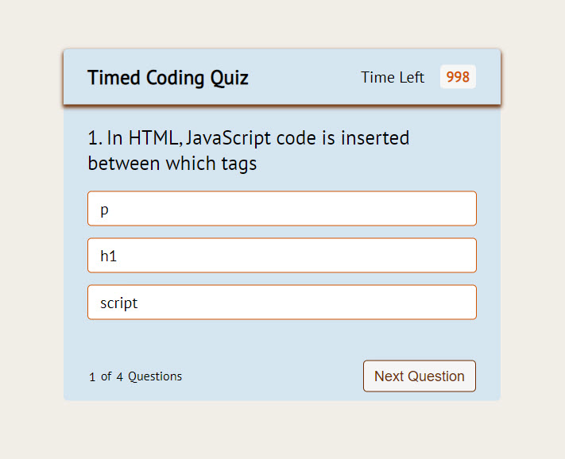
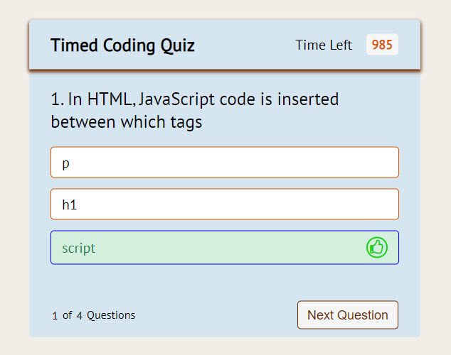
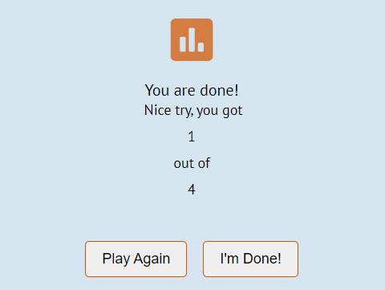

# Web API Code Quiz Project

# Description
In this project I was given the task to build a timed coding quiz with multiple-choice questions. This app is required to run in the browser and will feature dynamically updated HTML and CSS powered by JavaScript. 

Code was written to allow for the following:
The ability to click a start button which would then start a timer and present a question
When a question is answered another is presented
When an answer is incorrect, time is subtracted from the clock
When all questions are answered or the timer reaches 0 the game is over
My initials and score are saved

# Published Site and Repository Info
https://lindamart.github.io/web-api-code-quiz/

https://github.com/lindamart/web-api-code-quiz

Languages Used: HTML, CSS and JavaScript

# UI sample images

Question & Options box

Correct Answer

Final Score

